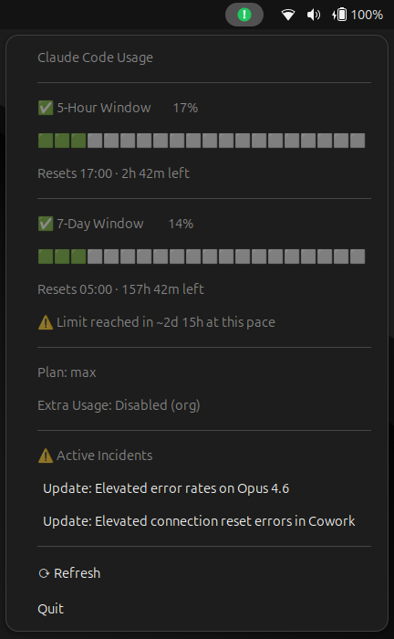

# Claude Status Tray

A Linux system tray application that displays real-time Claude API usage and rate limits.


## Features

- System tray icon with color indicator (green / orange / red) based on current usage level
- Shows usage for two rate-limit windows: **5-hour** and **7-day**
- **7-day forecast** based on current consumption rate
- Live **status feed** from [status.claude.com](https://status.claude.com) with clickable incident links
- Auto-refresh every 30 minutes (spinner animation while loading)
- Reads your existing Claude CLI session — no additional API key needed

## Screenshot



## Requirements

### System packages

```bash
sudo apt install python3-gi gir1.2-gtk-3.0 gir1.2-ayatana-appindicator3-0.1
```

### Claude CLI

The app requires the [Claude Code CLI](https://claude.ai/code) to be installed and authenticated:

```bash
npm install -g @anthropic-ai/claude-code
claude login
```

Usage data is fetched by running a minimal `claude` command and reading the rate-limit headers from the response.

## Installation

```bash
git clone https://github.com/KarlDevelops/claude-status-tray.git
cd claude-status-tray
chmod +x claude_status_tray.py
```

## Usage

### Run directly

```bash
./claude_status_tray.py
```

### Add to autostart (GNOME)

Create a `.desktop` file and copy it to your autostart directory:

```bash
cat > ~/.config/autostart/claude-status-tray.desktop << EOF
[Desktop Entry]
Type=Application
Name=Claude Status Tray
Comment=Shows Claude CLI usage in the system tray
Exec=/path/to/claude-status-tray/claude_status_tray.py
Terminal=false
Categories=Utility;
StartupNotify=false
EOF
```

Replace `/path/to/claude-status-tray/` with your actual installation path.

## How it works

- Executes `claude -p "hi"` in a subprocess and extracts the `anthropic-ratelimit-unified-*` response headers
- Reads subscription type from `~/.claude/.credentials.json` (your local Claude CLI session — never stored in this repo)
- Fetches the Atom feed from `https://status.claude.com/history.atom` for incident information
- All credentials remain local to your machine

## Tray icon colors

| Color  | Meaning                        |
|--------|-------------------------------|
| Green  | Usage below 50 %               |
| Orange | Usage between 50 % and 80 %    |
| Red    | Usage above 80 %               |

## Contributing

Pull requests welcome. Please open an issue first to discuss significant changes.

## License

MIT
